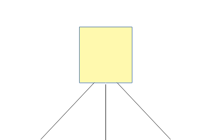
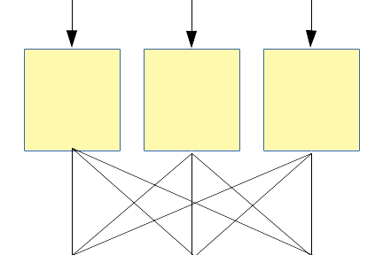
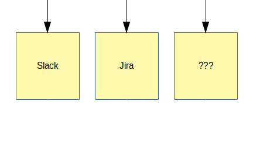

# example-1

## Overview

| Visual flow                     | Narrative                            |
| :-----------------------------: | :----------------------------------- |
|  | The source of the  binary is an RPM located at [Senzing's YUM repository](https://senzing-production-yum.s3.amazonaws.com/senzingrepo-1.0.0-1.x86_64.rpm) |
|       | Multiple processes get a copy of the rpm and do the processing |
|        | The output goes to multiple places: <ul><li>Slack</li><li>Jira</li><li>something else</li></ul> |
